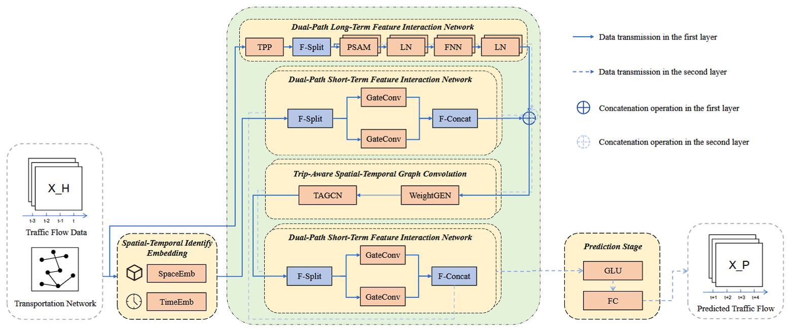

# TASTGCN



## Requirements

The code is built based on the following libraries and versions:

```
- Python == 3.8.18
- numpy == 1.22.4
- pandas == 2.0.3
- torch == 1.8.2+cu111
- torchvision == 0.9.2+cu111
- torchaudio == 0.8.2
- matplotlib == 3.7.2
- scikit-learn == 1.3.0
- scipy == 1.10.1
- einops == 0.8.0
```

## Data

The PEMS04 and PEMS08 datasets are located in the **data** folder directory.

## Usage

```python
python run.py
```
